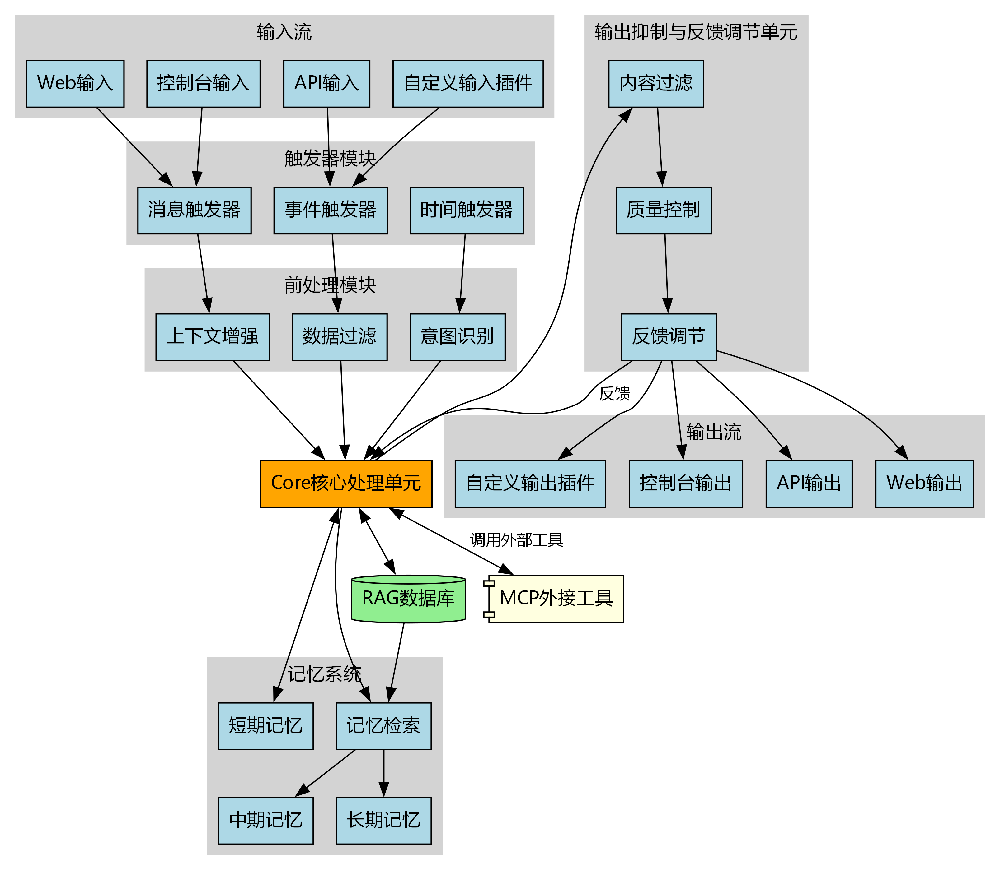

# Synapse AI 智能体框架

<p align="center">
  
  
  
</p>

---

## 🌟 项目简介

Synapse AI 是一套基于 AI API 的智能体开发框架，支持插件化、模块化和多场景扩展。专注于高可扩展性和灵活性，适用于多种智能体应用场景。

---

## 🏗️ 核心架构



1. **通用输入输出流（IO 流）**

   - 支持多种输入输出方式（如控制台、Web、API 等）
   - IO 流可通过插件方式扩展，便于集成新型输入输出渠道
   - 统一接口设计，降低扩展成本

2. **Trigger 模块（触发器）**

   - 监听和响应输入流事件
   - 支持多种可扩展触发器类型（如定时、消息、外部事件等）
   - 可配置的触发条件和优先级管理

3. **前处理模块**

   - 基于记忆系统进行上下文相关性计算
   - 输入数据预处理、过滤和增强
   - 意图识别与查询重构

4. **记忆系统**

   - 数据库缓存与上下文的三级记忆体系
     - 短期记忆：当前会话上下文
     - 中期记忆：最近交互历史与上下文
     - 长期记忆：持久化知识与经验
   - 高效的上下文检索与持久化
   - 记忆衰减与重要性评分机制

5. **Core 核心处理单元**

   - 智能体主逻辑、决策与任务分发
   - 集成 AI API，实现智能推理与响应
   - 动态思维链与推理引擎
   - 多模型协同推理与结果融合

6. **输出抑制与反馈调节单元**

   - 输出内容抑制、过滤和反馈调节，提升交互质量
   - 安全性检查与内容审核
   - 输出质量动态评估与优化调整

7. **RAG 数据库**

   - 检索增强生成（RAG）知识库，提升知识广度与准确性
   - 支持向量数据库与传统数据库混合存储
   - 自适应知识更新与冲突解决

8. **输出插件**

   - 多种输出插件，便于扩展输出渠道和格式
   - 统一的输出格式转换与适配
   - 多模态输出能力（文本、图像、语音等）

9. **MCP 外接工具**
   - 通过 MCP（Module Connection Protocol）协议调用外部工具
   - 标准化工具调用接口与结果解析
   - 工具能力自描述与动态发现机制
   - 支持同步/异步调用模式

---

## 📁 目录结构

```
src/
  io/               # 输入输出流及插件
    input/          # 输入流插件（API、WebSocket等）
    output/         # 输出流插件（文本、图像、语音等）
    adapters/       # 输入输出适配器
  triggers/         # 触发器模块
    time_trigger/   # 时间触发器
    event_trigger/  # 事件触发器
    message_trigger/# 消息触发器
  preprocessing/    # 数据预处理模块
    intent/         # 意图识别
    filtering/      # 数据过滤
    enrichment/     # 数据增强
  memory/           # 记忆系统
    short_term/     # 短期记忆
    medium_term/    # 中期记忆
    long_term/      # 长期记忆
    retrieval/      # 记忆检索
  core/             # 核心处理单元
    reasoning/      # 推理引擎
    decision/       # 决策系统
    orchestration/  # 任务编排
  models/           # AI 模型与推理
    llm/            # 大语言模型接口
    embedding/      # 向量嵌入模型
    multimodal/     # 多模态模型
  output_control/   # 输出控制与抑制
    filter/         # 输出过滤器
    moderation/     # 内容审核
    quality/        # 质量控制
  rag/              # RAG 数据库
    vector_store/   # 向量存储
    indexing/       # 索引管理
    retrieval/      # 检索引擎
  tools/            # MCP 工具集成
    protocol/       # MCP 协议实现
    connectors/     # 工具连接器
    registry/       # 工具注册表
  api/              # API 端点
    rest/           # REST API
    graphql/        # GraphQL API
  config/           # 配置文件
  utils/            # 工具函数
```

---

## 🚀 快速开始

1. 安装依赖：
   ```bash
   pip install -r requirements.txt
   # 或
   run setup.bat
   ```
2. 运行主程序：
   ```bash
   python app.py
   # 或
   run run.bat
   ```
3. 配置输入输出流和插件，参考 `src/io/` 目录。

---

## 💡 使用示例

### 基本对话交互

```python
from synapse import SynapseAgent
from synapse.io.input import ConsoleInput
from synapse.io.output import ConsoleOutput

# 创建智能体实例
agent = SynapseAgent()

# 配置IO流
agent.add_input(ConsoleInput())
agent.add_output(ConsoleOutput())

# 启动智能体
agent.start()
```

### 添加自定义触发器

```python
from synapse import SynapseAgent
from synapse.triggers import TimeTrigger

# 创建定时触发器，每小时执行一次
time_trigger = TimeTrigger(
    interval=3600,
    action=lambda: agent.process("执行定期数据分析")
)

# 添加到智能体
agent.add_trigger(time_trigger)
```

### 集成外部工具

```python
from synapse.tools import MCPTool

# 定义外部计算器工具
calculator = MCPTool(
    name="calculator",
    description="执行数学计算",
    endpoint="http://localhost:5000/calculator",
    methods=["add", "subtract", "multiply", "divide"]
)

# 注册工具
agent.register_tool(calculator)

# 在对话中使用
# 用户: "计算 15 * 37 是多少?"
# 代理自动调用计算器工具执行计算
```

---

## 🔌 扩展与定制

### 新增输入插件

实现 `BaseInput` 接口：

```python
from synapse.io.base_input import BaseInput

class MyCustomInput(BaseInput):
    def initialize(self):
        # 初始化逻辑
        pass

    def start_listening(self):
        # 开始监听输入
        pass

    def stop_listening(self):
        # 停止监听
        pass
```

### 新增记忆存储

扩展记忆系统：

```python
from synapse.memory import MemoryManager

class CustomMemoryManager(MemoryManager):
    def store(self, data, memory_type="short_term"):
        # 自定义存储逻辑
        pass

    def retrieve(self, query, limit=10):
        # 自定义检索逻辑
        pass
```

### 定制 RAG 系统

```python
from synapse.rag import BaseRAG

class CustomRAG(BaseRAG):
    def index_document(self, document):
        # 索引文档
        pass

    def search(self, query, top_k=5):
        # 检索相关内容
        pass
```

---

## 📄 许可证

MIT License
